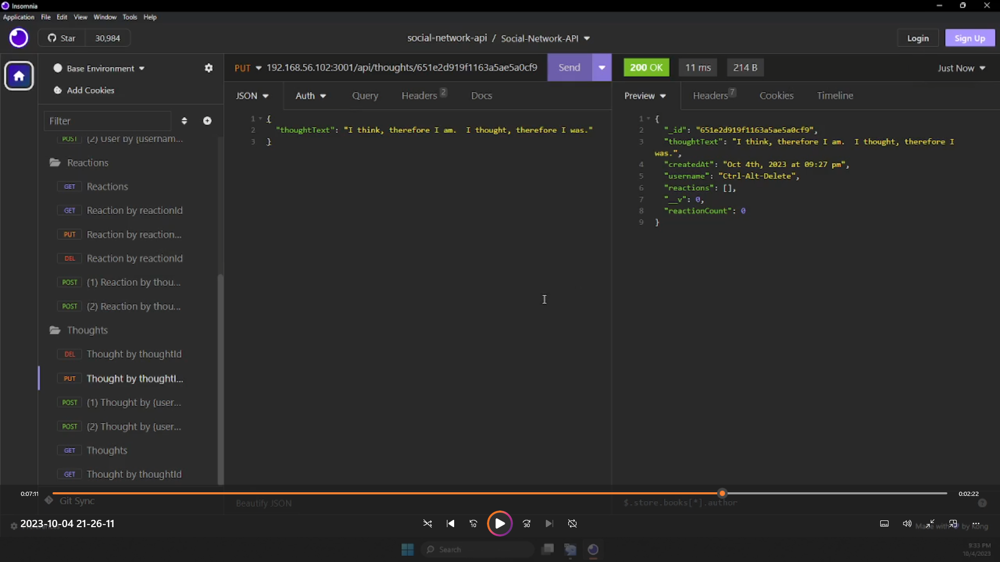

# Social-Network-API
## Description
This shows an API which utilizes a social network to connect people.
- I learned how to utilize Mongoose/MongoDB and Express to make an API, and how to improve on the specification.

## Installation
- `git clone git@github.com:JenevaRay/Social-Network-API.git`
- `cd Social-Network-API`
- `npm i`

## Usage of Development Environment
- `npm run dev`

## Usage of Production Environment
- `npm run start`

## Video (click to watch)

## License
[MIT License *file*](LICENSE)

https://opensource.org/licenses/mit
## Features
Recursive dis-association of Friend(ing) and un-Friend(ing), deep deletion of user thoughts and reactions, modification of existing reactions, and more

## Contributing and Questions
My GitHub profile: https://github.com/JenevaRay
Email me at JenevaRay@gmail.com with a Git push request and questions.
